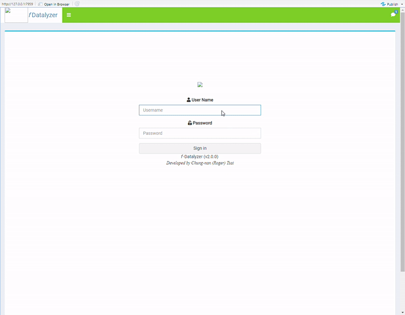

# f-Datalyzer Web App V2 
*Updated on 06/06/22, Author: Chung-nan (Roger) Tsai*

👋 Hello there! Thank you for taking the time to visit my Github repo. :pray:

> This web apps is aim to help field engineers to quickly understand what cause the system failure (from hundreds of sensors/process steps) on a fleet ( > 60+ processing chambers) when issue happened. To speed up the Root Cause Analysis and Corrective Action (RCCA). The ultimate goal is to build a `centralized dashboard application` which can providing information and comprehensive insights of data analysis. The app is called, `f-Datalyzer`. 

Here is a snap from the app shows, it is user login page[^1]. 
[^1]: The logo images are removed to avoid intellectual property violations. 



## Technologies Used
>The `f-Datalyzer` app is built using,

- [Shiny](https://shiny.rstudio.com/): Shiny is an R package to build interactive web apps, running upon on R programming.
- HTML/CSS

## Why R/Shiny?
- Do the job and delivery business value
- Provide frontend GUI (Shiny)
   -  Framework that allows users to create interactive web apps
     - Shiny abstracts the key technologies underlying modern web design (HTML, CSS, JavaScript)
- Tons of packages (ggplot2, tidyverse, etc.) are available & well-maintained  
- Save results to database (PostgreSQL, SQLite) and provides a nice dashboard for business to see value
- I am a shiny lover :heartpulse:, proficient in R 

## Apps Overview
>`f-Datalyzer` provides useful analytics to improve fleet productivity. Besides, machine learning methods are implemented for anomaly detection in time-series sensor data to predict system failures.

It is designed as two main dashboards as shown below. 
| Analytics | Fleet Insight |
| --- | --- |
| CSV file upload (Standalone[^2]) | Fleet traffic |
| Reduced dimension plot (Principle Component Analysis, PCA) | Chamber ranking |
| Data visualization (scatter plot, box plot , etc) | Detail view|
| Outlier detection (MD, ln. MD) ||
| Feature importance ranking ||
| Regression analysis ||

[^2]: Partial data is extracted from SQLite database


## 🏗️ Using Shiny Modules to simplify complex apps
> Modules are one of the most powerful tools for building shiny applications in a maintainable and sustainable manner.
- Compose complex apps out of smaller, more understandable pieces
- The app is divided up into pieces and each piece has a name. Naming the pieces means that the names of the controls can be simpler. ← namespacing
- Organize code into logical and easy-to-understand components
- Reuse code is possible
- Module is black box(input & output). It simplifier the structure to the whole app (no more Spaghetti code)
- Facilitates collaboration! 👍

## Directory Structure

```
myapp                         
    └── i18n
        └── en.js
        └── es.js
        └── de.js
        └── fr.js
        └── index.js                
    └── node_modules                    
```


## Analytics Tab 🔗

## Fleet Insight Tab 🔗


